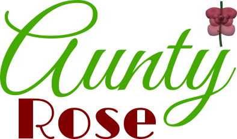

# Aunty Rose - SCSS-Style Theme Engine for VS Code



**Transform VS Code theme development from tedious to delightful.**

Stop wrestling with 800+ disconnected hex codes. Create beautiful,
maintainable themes with semantic variables, color functions, and design
systems that actually make sense.

## The Problem

VS Code theme development is a nightmare:

- 800+ flat color properties with zero relationships
- Want to adjust contrast? Hunt through dozens of files for related
  colors
- Copy-paste hex codes everywhere and pray nothing breaks
- No way to express design intent or maintain consistency

## The Solution

Write themes like a human, compile for VS Code:

**Before (traditional):**

```json
{
  "editor.background": "#1e1e1e",
  "editor.foreground": "#e6e6e6",
  "statusBar.background": "#002e63",
  "panel.background": "#1a1a1a"
}
```

**After (Aunty Rose):**

```yaml
vars:
  accent: "#4b8ebd"
  std:
    fg: "#e6e6e6"
    bg: "#1a1a1a"
    bg.panel: lighten($(std.bg), 15)
    bg.accent: darken($(accent), 15)

theme:
  colors:
    "editor.background": $(std.bg.panel)
    "editor.foreground": $(std.fg)
    "statusBar.background": $(std.bg.accent)
    "panel.background": $(std.bg)
```

Now when you want to adjust contrast, change one variable and watch it
cascade through your entire theme.

## Quick Start

No installation needed - use with npx:

```bash
# Create your first theme
npx @gesslar/aunty build my-theme.yaml

# Watch mode for development
npx @gesslar/aunty build my-theme.yaml --watch

# Custom output location
npx @gesslar/aunty build -o ./themes my-theme.yaml
```

## CLI Usage

```bash
# Basic compilation
npx @gesslar/aunty build <theme-file>

# Multiple files at once
npx @gesslar/aunty build theme1.yaml theme2.yaml theme3.yaml

# Watch for changes (rebuilds automatically)
npx @gesslar/aunty build --watch my-theme.yaml

# Custom output directory
npx @gesslar/aunty build --output-dir ./my-themes my-theme.yaml

# See the compiled JSON without writing files
npx @gesslar/aunty build --dry-run my-theme.yaml

# Silent mode (only show errors)
npx @gesslar/aunty build --silent my-theme.yaml

# Debug mode (detailed error traces)
npx @gesslar/aunty build --nerd my-theme.yaml
```

### Build Command Options

| Option | Description |
|--------|-------------|
| `-w, --watch` | Watch files and rebuild on changes |
| `-o, --output-dir <dir>` | Specify output directory |
| `-n, --dry-run` | Print JSON to stdout instead of writing files |
| `-s, --silent` | Only show errors (useful for scripts) |
| `--nerd` | Verbose error mode with stack traces |

### Debugging Your Themes

**See what a variable resolves to:**

```bash
npx @gesslar/aunty resolve --token editor.background my-theme.yaml
```

This shows you the complete resolution chain for any theme property, displaying each step of variable substitution and function evaluation with color-coded output.

### Resolve Command Options

| Option | Description |
|--------|-------------|
| `-t, --token <key>` | Resolve a specific token/variable to its final value |
| `--nerd` | Show detailed error traces if resolution fails |

## Basic Theme Structure

```yaml
# my-awesome-theme.yaml
config:
  name: "My Awesome Theme"
  type: dark

vars:
  # Your color palette
  primary: "#4b8ebd"
  success: "#4ab792"
  error: "#b74a4a"

  # Build semantic relationships
  std:
    fg: "#e6e6e6"
    bg: "#1a1a1a"
    accent: $(primary)
    bg.accent: darken($(accent), 15)

theme:
  colors:
    # Editor
    "editor.foreground": $(std.fg)
    "editor.background": $(std.bg)
    "editor.selectionBackground": $(std.bg.accent)

    # UI
    "statusBar.background": $(std.bg.accent)
    "activityBar.background": $(std.bg)
    "sideBar.background": $(std.bg)
```

## Color Functions

Make colors that work together:

| Function | Example | Result |
|----------|---------|--------|
| `lighten(color, %)` | `lighten($(bg), 25)` | 25% lighter background |
| `darken(color, %)` | `darken($(accent), 30)` | 30% darker accent |
| `fade(color, alpha)` | `fade($(accent), 0.5)` | Set to 50% transparent |
| `alpha(color, value)` | `alpha($(brand), 0.5)` | Set exact transparency |
| `mix(color1, color2, %)` | `mix($(fg), $(accent), 20)` | Blend 20% accent |
| `invert(color)` | `invert($(fg))` | Perfect opposite |
| `solidify(color, alpha)` | `solidify($(bg.accent), 0.3)` | Increase opacity to 30% |

## Variable Reference

Use any of these syntaxes (they're identical):

```yaml
vars:
  accent: "#4b8ebd"

  # All equivalent:
  variant1: $(accent)          # Recommended
  variant2: $accent            # Short form
  variant3: ${accent}          # Braced form
```

## Theme Development Workflow

### 1. Create Your Theme File

```bash
# Create a new theme file
touch ocean-theme.yaml
```

### 2. Set Up Watch Mode

```bash
# Start watching for changes
npx @gesslar/aunty build --watch ocean-theme.yaml
```

### 3. Install Your Theme

After compilation, you'll get a `.color-theme.json` file:

1. **Copy to VS Code**: Place in `~/.vscode/extensions/my-themes/themes/`
2. **Or package as extension**: Use `yo code` to create a theme extension
3. **Test immediately**: Press `Ctrl+K Ctrl+T` in VS Code to switch themes

### 4. Iterate and Refine

With watch mode, every save triggers recompilation. VS Code will
automatically reload your theme changes.

### Output Files

Aunty Rose generates standard VS Code theme files:

```bash
my-theme.yaml  →  my-theme.color-theme.json
```

The output file name is based on your input file, with `.color-theme.json`
extension.

## Advanced Features

### Modular Theme Design

Break your themes into reusable components using the import system:

```yaml
# colors.yaml
vars:
  palette:
    primary: "#4b8ebd"
    success: "#4ab792"
    error: "#b74a4a"
    warning: "#b36b47"

---

# my-theme.yaml
config:
  name: "My Theme"
  type: dark
  imports:
    vars:
      colors: "./colors.yaml"

vars:
  # Use imported colors
  accent: $(colors.palette.primary)

  # Build your design system
  std:
    fg: "#e6e6e6"
    bg: "#1a1a1a"
    accent: $(accent)
    bg.accent: darken($(accent), 15)

theme:
  colors:
    "editor.foreground": $(std.fg)
    "editor.background": $(std.bg)
    "statusBar.background": $(std.bg.accent)
```

### Import System

Aunty Rose supports importing different types of theme components:

```yaml
config:
  imports:
    # Import variables (merged into your vars section)
    vars:
      colors: "./shared/colors.yaml"
      # Can import multiple files
      typography: ["./shared/fonts.yaml", "./shared/sizes.yaml"]

    # Import global configuration
    global:
      base: "./shared/base-config.yaml"

    # Import VS Code color definitions
    colors:
      ui: "./shared/ui-colors.yaml"

    # Import syntax highlighting rules
    tokenColors:
      syntax: "./shared/syntax.yaml"

    # Import semantic token colors
    semanticTokenColors:
      semantic: "./shared/semantic.yaml"
```

**Import Format Options:**

- **Single file:** `"./path/to/file.yaml"`
- **Multiple files:** `["./file1.yaml", "./file2.yaml"]`
- **File types:** Both `.yaml` and `.json5` are supported

**Merge Order:**

The merge happens in a precise order with each level overriding the previous:

1. `global` imports (merged first)
2. `colors` imports
3. `tokenColors` imports
4. `semanticTokenColors` imports
5. Your theme file's own definitions (final override)

Within each section, if you import multiple files, they merge in array order. This layered approach gives you fine-grained control over which definitions take precedence.

### Watch Mode for Development

Perfect for theme development - see changes instantly:

```bash
npx @gesslar/aunty build my-theme.yaml --watch
```

Now edit your YAML file and watch VS Code update automatically!

## Tips for Great Themes

### Start with Meaning, Not Colors

```yaml
# ❌ Don't start with random colors
vars:
  red: "#ff0000"
  blue: "#0000ff"

# ✅ Start with semantic meaning
vars:
  status:
    error: "#b74a4a"
    success: "#4ab792"

  ui:
    background: "#1a1a1a"
    surface: lighten($(ui.background), 15)
```

### Use Mathematical Relationships

```yaml
# Colors that harmonize automatically
vars:
  base: "#4b8ebd"

  harmonies:
    lighter: lighten($(base), 20)
    darker: darken($(base), 20)
    complement: mix($(base), invert($(base)), 50)
    muted: mix($(base), "#808080", 30)
```

### Test with Real Code

Always test your themes with actual code files to see how syntax
highlighting looks with your color choices.

## More Examples

Check out the `/examples` folder for complete theme files showing
different approaches and techniques.

## Troubleshooting

### Common Issues

**Theme not appearing in VS Code:**

- Check that the output file ends with `.color-theme.json`
- Verify the file is in your extensions themes folder
- Try reloading VS Code (`Ctrl+Shift+P` → "Developer: Reload Window")

**Compilation errors:**

```bash
# See detailed error information
npx @gesslar/aunty build --nerd my-theme.yaml

# Check what a specific variable resolves to
npx @gesslar/aunty resolve --token problematic.variable my-theme.yaml
```

**Variables not resolving:**

- Check variable names for typos
- Use the resolve command to trace dependency chains
- Look for circular references (variables referencing themselves)

**Watch mode not updating:**

- Check that files aren't being saved outside the watched directory
- Try restarting watch mode
- Verify file permissions

## Getting Help

- **Examples**: Complete theme files in the `/examples` directory
- **Issues**: Report bugs or request features on GitHub
- **Community**: Share your themes and get feedback

## License

**The Unlicense** - Use this however you want! The idea of copyrighting
color arrangements is absurd.

---

*Aunty Rose: Because your themes deserve better than hex codes.*
